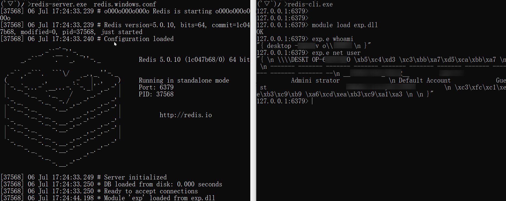

# RedisModules ExecuteCommand for Windows
可在Windows下执行系统命令的Redis模块 。   
可在Linux下执行系统命令的Redis模块在 

## 快速开始
已经有编译好了的模块`exp.dll`，你也可以自行修改、编译，以下是可参考的的步骤：  
1.  用vs2017打开exp.sln文件。
2.  修改exp.c源文件。
2.  编译生成模块`exp.dll`  。
4.  在Redis中加载`exp.dll`，并使用模块的命令  。

## 模块命令  
该模块有一个命令`e`，可以执行系统命令。
在redis-cli命令行下，执行如下命令：

```
127.0.0.1:6379> module load exp.dll
127.0.0.1:6379> exp.e whoami
127.0.0.1:6379> exp.e net user
```

  

## 反馈
Mail：h.vi@qq.com   
或者 [issue](https://github.com/0671/RedisModules-ExecuteCommand-for-Windows/issues/new)、PR  
